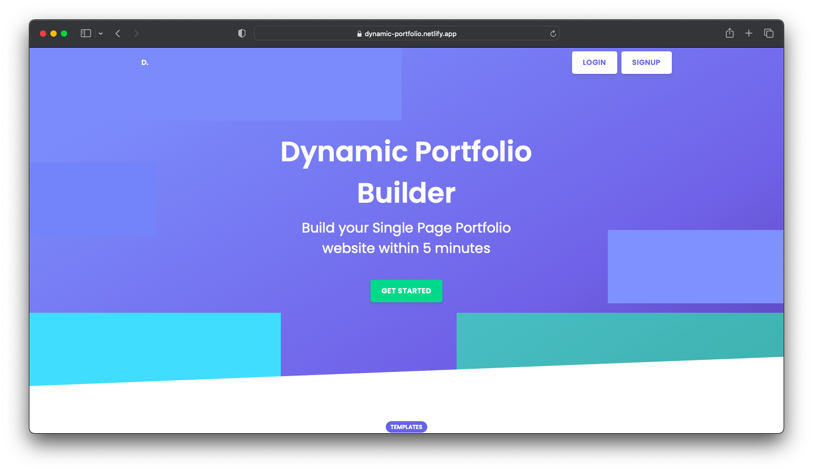
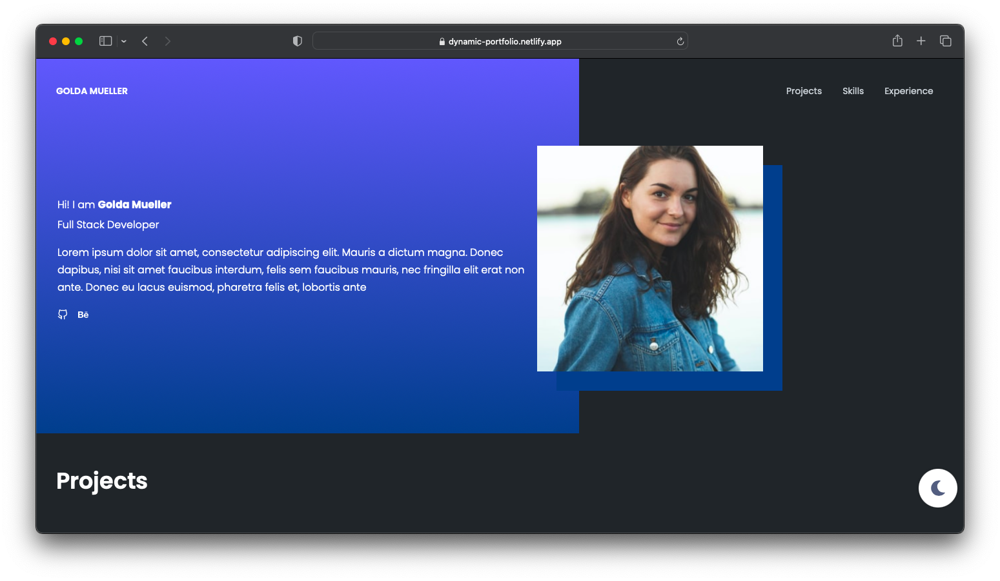
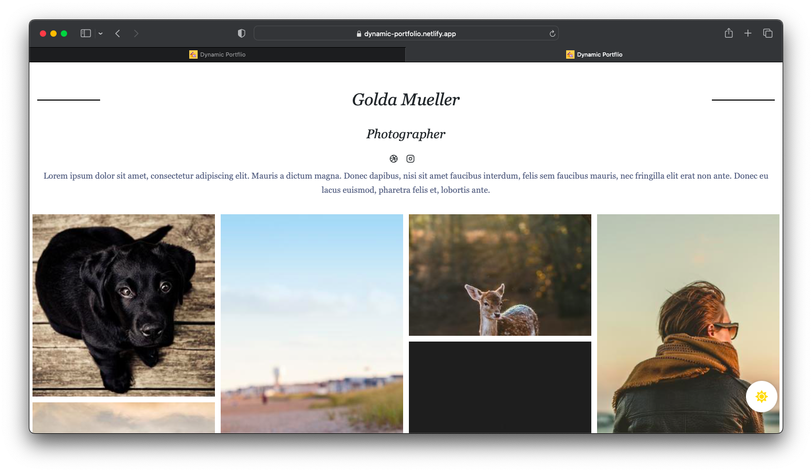
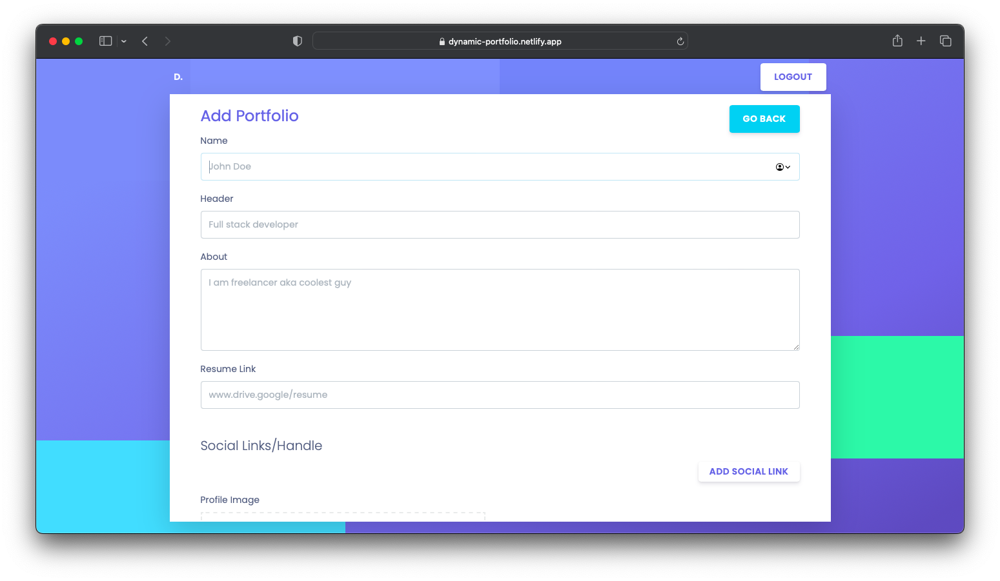

[](http://makeapullrequest.com)
[](https://github.com/ellerbrock/open-source-badges/)

# 📌 Introduction

Dynamic Portfolio helps you create simple websites by just filling out forms

As of now two templates are available with dark and light mode.

[Template 1 - Student Portfolio](https://dynamic-portfolio.netlify.app/portfolio/630f44611ddb0f899c66e399)

[Template 2 - Photographer Portfolio](https://dynamic-portfolio.netlify.app/portfolio/630f51c81ddb0f899c66e39a)

MVP is completed **This is an Ongoing Project**.

> Please free to contribute !

---

## ⭐ Deployment

[Web app is hosted here at Netlify](https://dynamic-portfolio.netlify.app/)

[](https://app.netlify.com/sites/dynamic-portfolio/deploys)

---

**_P.S Enter valid mail when registering_**

If you want to just try out then user this email id and password.

```
email:golda.mueller0@ethereal.email
password:	TvQhFDEzZuaDB7yvy5
[space included]
```

---

# ⭐ Screens





