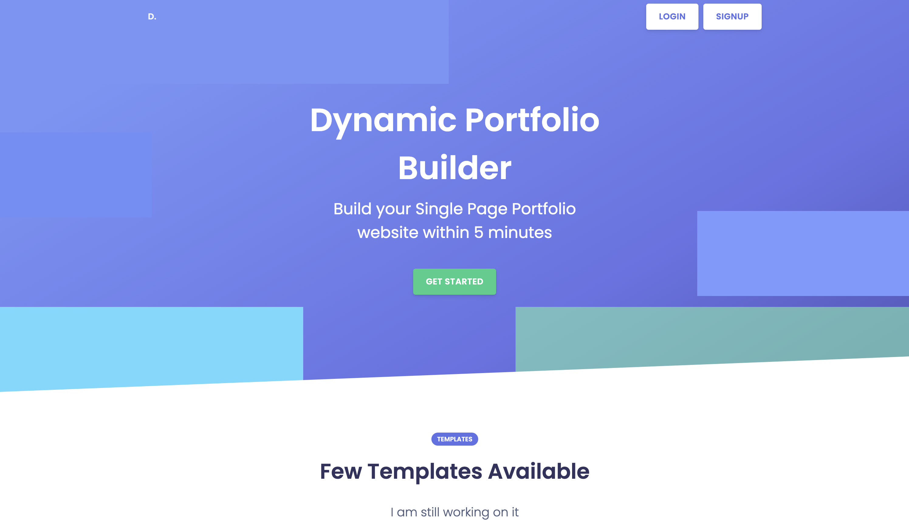
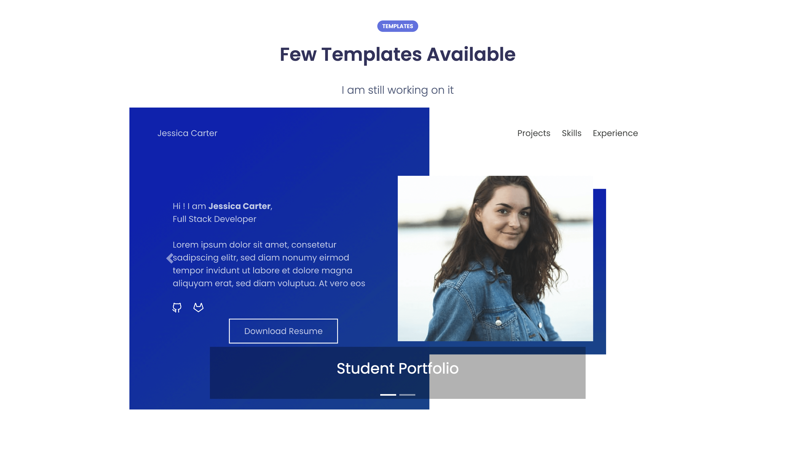
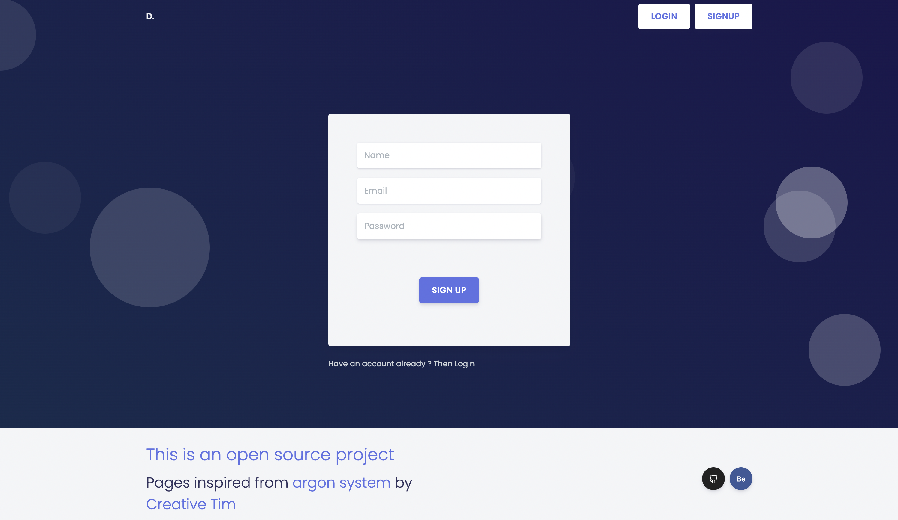
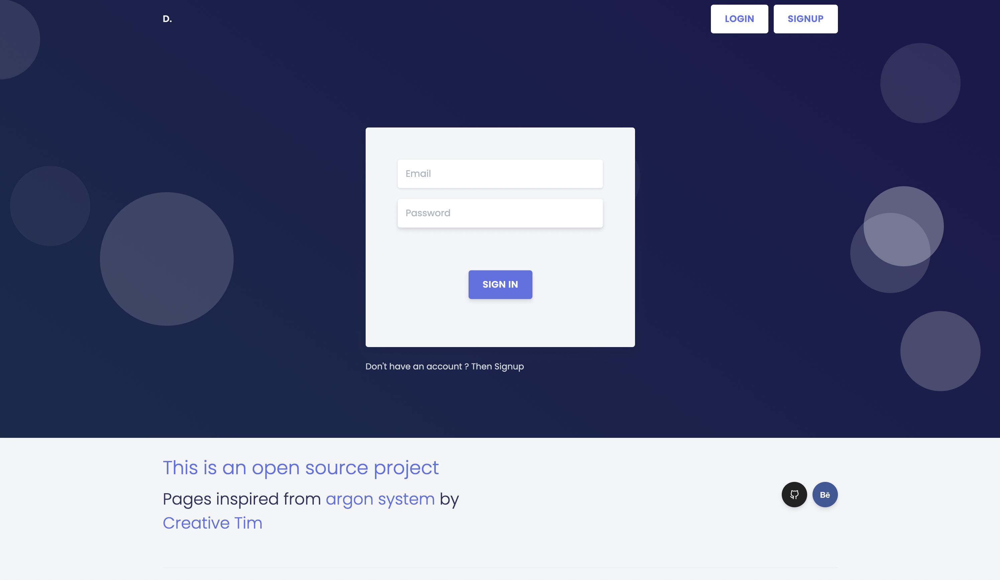
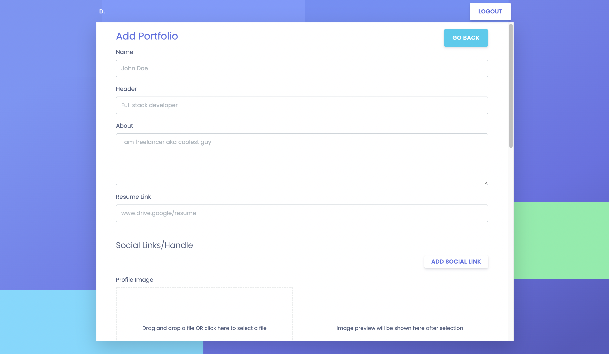
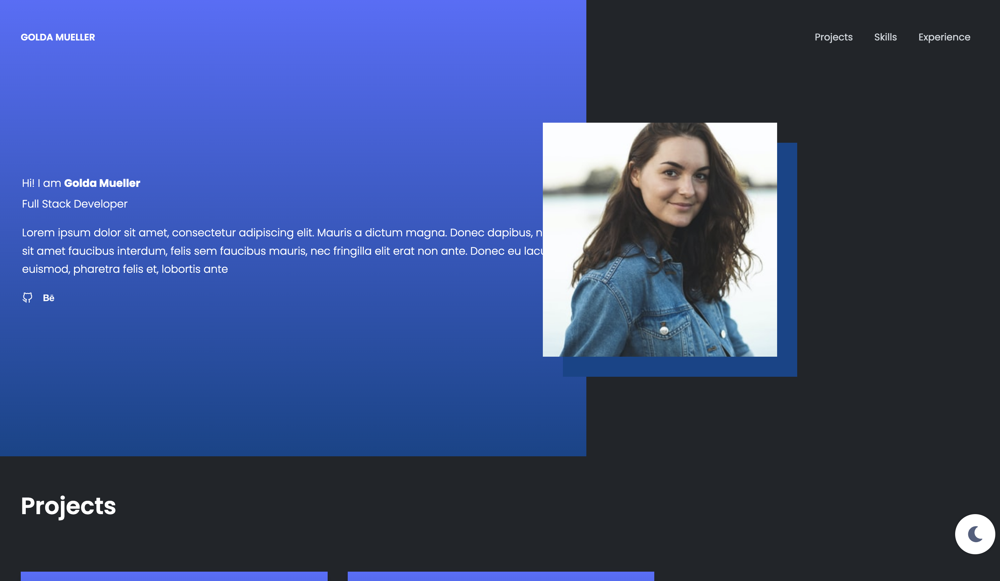

[](http://makeapullrequest.com)
[](https://github.com/ellerbrock/open-source-badges/)

# 📌 Introduction

Dynamic Portfolio helps you create simple websites by just filling out forms. This helps remove the burden of writing hundreds of lines of code, or the financial loss of paying a professional website developer to create your personal website for you.

The aim of the website is to provide several templates, each catering to the user's individual needs, both in light and dark mode.

At present, there are two templates for the user to work with.

[Template 1 - Student Portfolio](https://dynamic-portfolio.netlixfy.app/portfolio/630f44611ddb0f899c66e399)

[Template 2 - Photographer Portfolio](https://dynamic-portfolio.netlify.app/portfolio/630f51c81ddb0f899c66e39a)

MVP is completed **This is an Ongoing Project**.

> Please free to contribute !

---

## ⭐ Deployment

[Web app is hosted here at Netlify](https://dynamic-portfolio.netlify.app/)

[](https://app.netlify.com/sites/dynamic-portfolio/deploys)

---

**_P.S Enter valid mail when registering_**

If you want to just try out then user this email id and password.

```
email:golda.mueller0@ethereal.email
password:	TvQhFDEzZuaDB7yvy5
[space included]
```

---

# ⭐ Screens

Here is an overview of the **flow of control** of the website.



This is the first screen shown on running the website. It covers basic data and utility of the site.


Upon scrolling down on the initial page, you get a carousel, which shows examples of templates that can be used (Here, two.)


The signup page collects data, thereby registering the members onto the site. 


After the one time sign-up, everytime a user wants to log into their account, they have to go through this site.


Post sign in, we are redirected to this page. Past portfolios are loaded up here, as well as new portfolios can be added.


To make a new portfolio, a template has to be chosen from the total number of existing templates.


After making the choice, we are redirected to a data-filling page. This is the only step needed to be taken by the user to get a ready-made portfolio website.


This is the light version of the Student Portfolio.


This is the dark version of the Student Portfolio.
